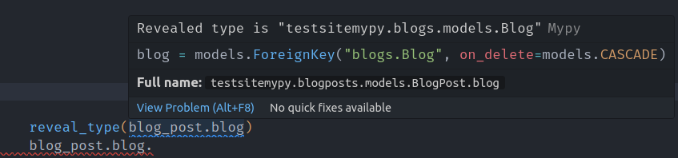

# Context

!!! info
    This section expands on [this article](https://viicos.github.io/posts/an-alternative-to-the-django-mypy-plugin/),
    which goes into more technical details.

This section describes how `django-autotyping` is able to provide features working with any type checker and without
having to manually annotate your code.

## The current state of typing with Django

Django being created way before type hints were a thing in Python, it wasn’t designed with typing support in mind. For this reason,
external type stubs are maintained by the [TypedDjango](https://github.com/typeddjango/) organization.

By installing `django-stubs`, you will be able to enforce type checking in your Django project, and also benefit from a nicer development experience assuming you are using a [LSP](https://microsoft.github.io/language-server-protocol/) implementation in your IDE.

However, it is sometimes not possible to support all the dynamic features provided by Django at runtime.

The most common (and probably annoying) example appears when dealing with models and foreign fields:

```python
from django.db import models

class Blog(models.Model): ...

class BlogPost(models.Model):
    name = models.CharField(
        max_length=255,
    )
    blog = models.ForeignKey(
        to="Blog",
        on_delete=models.CASCADE,
    )
```

When accessing attributes of this model at runtime, the database type is mapped to a Python type:

```python
>>> type(blog_post.name)
#> <class 'str'>
>>> blog_post.blog
#> <Blog: My blog>
```

However, there is currently no way to describe the type of `blog_post.post` using native typing features (as it is being referenced as a string to avoid [circular imports][django.db.models.ForeignKey]).

To overcome this issue, a [mypy](https://mypy.readthedocs.io/en/stable/) plugin is provided, that will make use of your
project settings to discover the available models, so that mypy can understand string references, amongst other features.

## The drawbacks of using the mypy plugin

Using a type checker can be beneficial to catch errors that would usually result in unhandled exceptions at runtime.
To get immediate feedback on these errors along with the inferred types of your code, the type checker can be hooked up in your IDE via a [LSP](https://microsoft.github.io/language-server-protocol/) integration
(for VSCode users, this is what [Pylance](https://marketplace.visualstudio.com/items?itemName=ms-python.vscode-pylance) is essentially doing).

Does this mean we can get all the nice auto-completions and features provided by mypy and the Django plugin?

Not really. While LSP implementations for mypy [are available](https://github.com/python-lsp/pylsp-mypy/), they seem to be lacking
important features that you would expect in an IDE. You do get the correct types from the mypy plugin, but you are missing all the highlights/auto-completions:



## Using customized stubs for your project

To overcome this issue, we need to find a solution that would ideally:

- Be agnostic of any type checker, that is only using the existing Python typing logic.
- Avoid having to manually annotate your code, if possible.

`django-autotyping` will take advantage of the ability to use a custom type stubs directory (you might need to configure your type checker TODO link), where a customized copy of `django-stubs` will be created. Because `django-autotyping` knows the current
state of your application (e.g. the available models, views), it will generate additional overloads when possible, matching string
references to your models for example.

???+ example
    A smart feature available in type checkers is to add [overloads][typing.overload] to the `__init__` method
    of a class to influence the constructed object type. With the following:

    ```python
    # __set__ value type
    _ST = TypeVar("_ST")
    # __get__ return type
    _GT = TypeVar("_GT")

    class ForeignKey(Generic[_ST, _GT]):
        @overload
        def __init__(
            self: ForeignKey[Blog | Combinable | None, Blog | None],
            to: Literal["Blog", "blogs.Blog"],
            ...,
            null: Literal[True],
            ...
        ): ...
        @overload
        def __init__(
            self: ForeignKey[Blog | Combinable, Blog],
            to: Literal["Blog", "blogs.Blog"],
            ...,
            null: Literal[False] = ...,
            ...
        ): ...
    ```

    Without going into the details of the Django field descriptors, this enables the following:

    ```python
    class BlogPost(models.Model):
        blog = models.ForeignKey(
            to="Blog",
            on_delete=models.CASCADE,
        )

    BlogPost().blog  # typed as "Blog", or "Blog | None" if null was set to `True`
    ```

    You get:

    - Complete support for typed foreign fields, without any manual annotations
    - Support for nullable fields
    - Complete IDE support!

## Dynamic stubs dont' solve everything

Even if the generated dynamic stubs cover a lot of cases, explicit annotations are still required sometimes.
Consider the use case of reverse relationships:

```python
# On a blog instance, the related blog posts can be accessed:
blog.blogpost_set  # Or with a custom attribute name, by specifying `related_name`
```

To make the type checker aware of this attribute, you have to explicitly annotate the `Blog` class:

```python
class Blog(models.Model):
    # `BlogPost` also needs to be imported, and the `Manager` class
    # used might differ:
    blogpost_set: Manager[BlogPost]
```

For these kind of use cases, `django-autotyping` provides a `add_type_hints` command, that will take care
of automatically add type hints to your source code.
